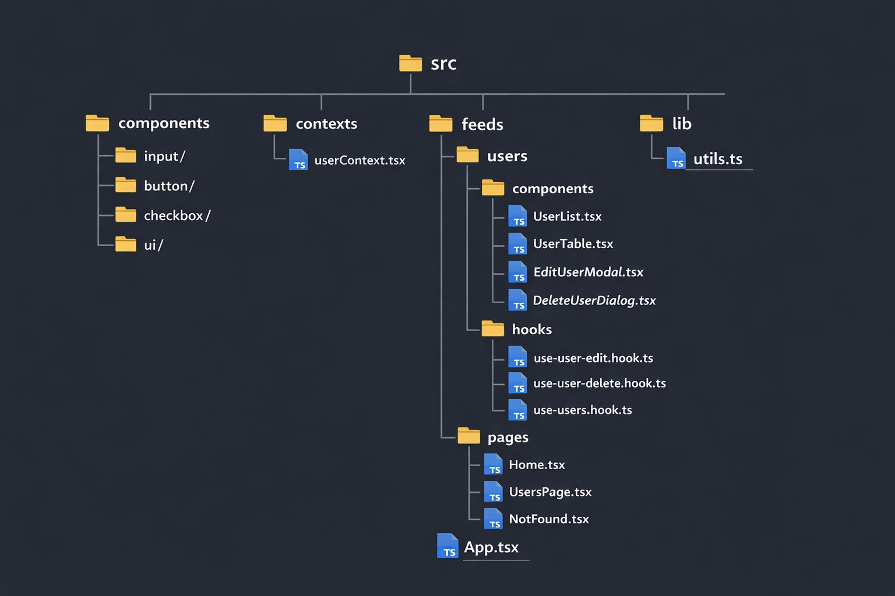
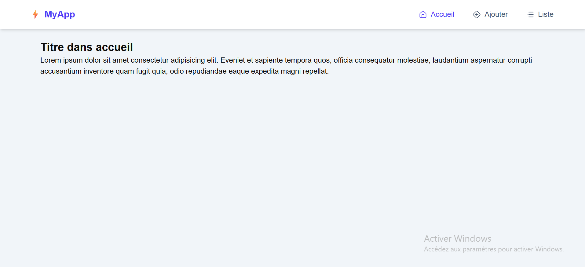
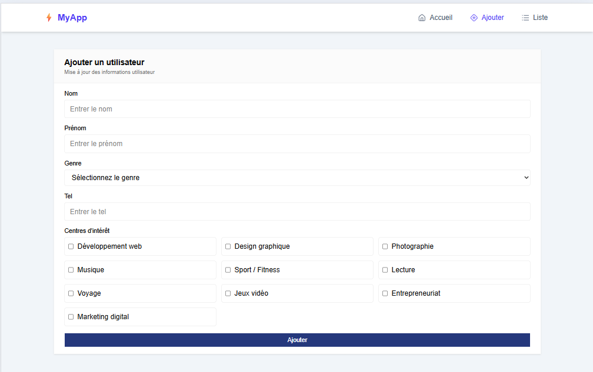
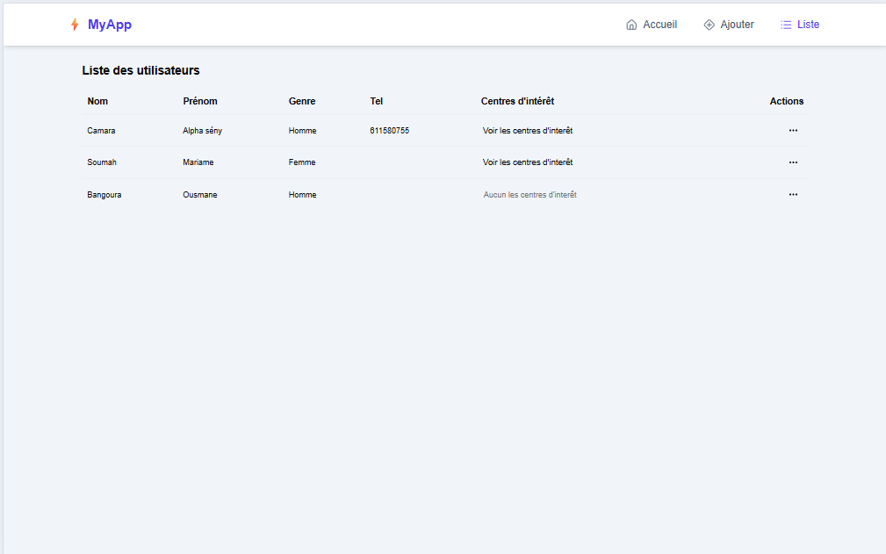
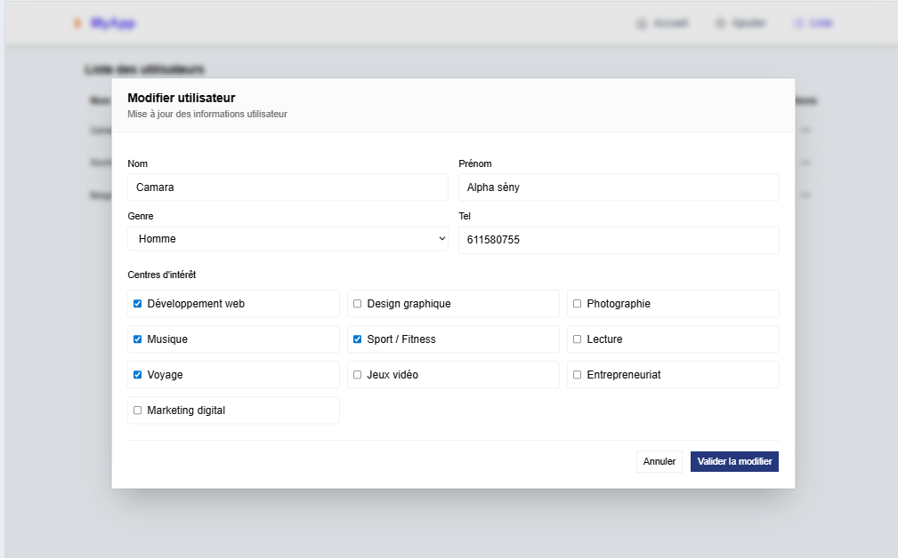
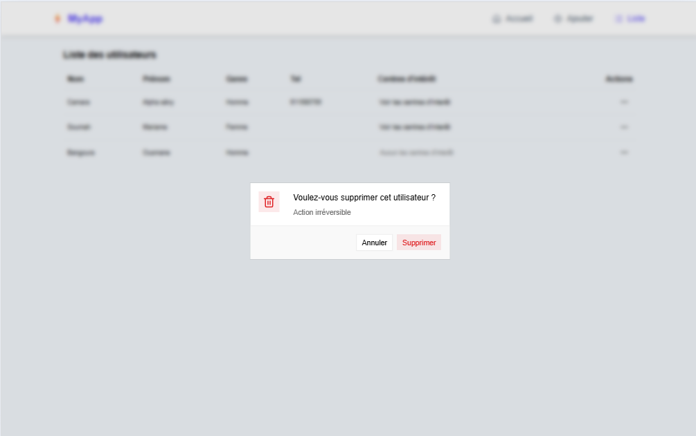

# 👤 Gestion des Utilisateurs

## 📖 Description du projet

Ce projet est une application web de **gestion des utilisateurs** développée avec React.  
Il permet d’effectuer des opérations CRUD (Create, Read, Update, Delete) sur une liste d’utilisateurs avec une interface moderne et interactive.

L’objectif principal est de pratiquer :

- la gestion d’état global avec Context API
- la manipulation de formulaires avec React Hook Form
- la création de composants réutilisables
- l’optimisation de l’UI/UX avec des composants modernes

---

## 🚀 Fonctionnalités

### 👥 Gestion des utilisateurs

- Affichage d’une liste d’utilisateurs dans un tableau dynamique
- Ajout d’un utilisateur (via formulaire dédié)
- Modification d’un utilisateur via une modal
- Suppression avec confirmation (AlertDialog)

---

### ✏️ Edition des utilisateurs

- Ouverture d’une modal de modification
- Pré-remplissage automatique des données
- Validation des champs avec React Hook Form
- Mise à jour en temps réel de la liste

---

### 🗑️ Suppression sécurisée

- Confirmation avant suppression
- Protection contre les suppressions accidentelles

---

### 🎯 Centres d’intérêt

- Sélection multiple via checkbox
- Affichage dynamique dans une section déroulante
- Gestion des intérêts par utilisateur

---

### 🎨 Interface utilisateur

- Design moderne avec composants UI réutilisables
- Table responsive et propre
- Dropdown menu pour les actions
- Modal élégante pour édition et suppression
- Animations fluides avec Framer Motion

---

## 🧠 Technologies utilisées

### Frontend

- React.js
- TypeScript
- Tailwind CSS

### State management

- React Context API

### Formulaires

- React Hook Form
- Validation avec regex et rules personnalisées

### UI Components

- ShadCN UI (ou composants custom)
- Dropdown Menu
- Alert Dialog
- Table Components

### Animations

- Framer Motion

---

## 📁 Architecture du projet



## ⚙️ Fonctionnement global

1. Les utilisateurs sont stockés dans un **Context global**
2. La liste est affichée sous forme de tableau
3. Chaque ligne possède des actions :
   - Modifier
   - Supprimer
4. La modification ouvre une modal avec formulaire pré-rempli
5. Les changements sont immédiatement reflétés dans la liste

---

## 🧪 Validation des formulaires

- Champs obligatoires : nom, prénom, genre
- Téléphone optionnel avec validation regex
- Affichage des erreurs en temps réel
- Gestion propre des erreurs via React Hook Form

---

## 📸 Aperçu du projet

### 🧾 Page d'accueil



### 🧾 Page d'ajout d'utilisateur



### 🧾 Liste des utilisateurs



### ✏️ Modal de modification



### 🗑️ Modal de suppression d'utilisateur



## 🛠️ Installation

```bash
# Cloner le projet
git clone https://github.com/ton-repo.git

# Installer les dépendances
npm install

# Lancer le projet
npm run dev


```
